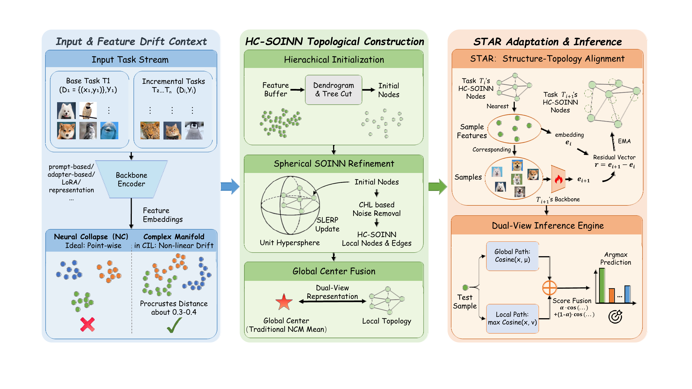

# HC-SOINN: Topology-Aware Hierarchical Classifier for Class-Incremental Learning

[](https://icml.cc/)
[](https://pytorch.org/)

This repository contains the official PyTorch implementation of **Beyond Point-wise Neural Collapse: A Topology-Aware Hierarchical Classifier for Class-Incremental Learning**, accepted at ICML 2026.

## Overview

HC-SOINN revisits the Nearest Class Mean (NCM) classifier commonly used in Class-Incremental Learning (CIL). Instead of assuming that each class collapses into a single prototype, HC-SOINN represents each class as a topology-aware manifold composed of local sub-prototypes and a global center.

The framework further introduces **STAR** (Structure-Topology Alignment via Residuals), a pointwise trajectory tracking mechanism that adapts the learned topology to non-linear feature drift across incremental tasks.



## Getting Started

### Environments

The provided environment file can be used to create the conda environment:

```bash
conda env create -f environment_hc_soinn.yaml
conda activate hcsoinn
```

Main dependencies include:

- `python==3.10.19`
- `torch==2.0.1`
- `torchvision==0.15.2`
- `timm==0.6.12`
- `numpy==1.26.4`
- `scipy==1.15.3`
- `scikit-learn==1.7.2`
- `matplotlib==3.10.7`

### Dataset Preparation

Datasets are loaded from the `data/Datasets` directory at the same level as this repository. A typical layout is:

```text
data/
└── Datasets/
    ├── cifar-100-python/
    ├── cub/
    │   ├── train/
    │   └── test/
    └── imagenet-r/
        ├── train/
        └── test/
```


### Training

To train a model, run:

```bash
python main.py --config <json_config_path>
```

You can override the GPU device from the command line:

```bash
python main.py --config ./exps/coda_prompt/coda_prompt_hc_soinn_star.json --device 0
```

## Supported Datasets and Examples

### Split CIFAR-100

```bash
python main.py --config ./exps/simplecil/simplecil_hc_soinn.json
python main.py --config ./exps/dualprompt/dualprompt_hc_soinn.json
python main.py --config ./exps/coda_prompt/coda_prompt_hc_soinn_star.json
python main.py --config ./exps/sema/sema_hc_soinn.json
python main.py --config ./exps/cllora/cllora_hc_soinn_star.json
```

### Split CUB-200

```bash
python main.py --config ./exps/simplecil/simplecil_hc_soinn_cub.json
python main.py --config ./exps/dualprompt/dualprompt_hc_soinn_cub_star.json
python main.py --config ./exps/coda_prompt/coda_prompt_hc_soinn_star_cub.json
python main.py --config ./exps/sema/sema_hc_soinn_cub.json
python main.py --config ./exps/cllora/cllora_hc_soinn_cub_star.json
```

### Split ImageNet-R

```bash
python main.py --config ./exps/simplecil/simplecil_hc_soinn_inr.json
python main.py --config ./exps/dualprompt/dualprompt_hc_soinn_inr.json
python main.py --config ./exps/aper_adapter/aper_adapter_hc_soinn_inr.json
python main.py --config ./exps/ease/ease_hc_soinn_inr.json
python main.py --config ./exps/sema/sema_hc_soinn_inr.json
python main.py --config ./exps/cllora/cllora_hc_soinn_inr_star.json
```

## Configuration

The JSON configuration files define the dataset split, backbone, baseline method, optimizer, and HC-SOINN/STAR settings.

Key method switches include:

- **`use_hc_soinn`**: Enable the HC-SOINN classifier for supported baselines.
- **`use_feature_alignment`**: Enable STAR feature-drift alignment.

Key HC-SOINN/STAR parameters include:

- **`hcsoinn_max_proto_per_class`**: Target number of topological prototypes per class.
- **`hcsoinn_alpha`**: Balance factor between the global NCM score and the local topology score.
- **`hcsoinn_soinn_ad`**: Maximum edge age used for SOINN topology maintenance.
- **`hcsoinn_soinn_max_iter`**: Number of SOINN refinement passes.
- **`star_lambda`**: EMA momentum for pointwise residual tracking in STAR.

### Example Configuration

```json
{
  "model_name": "coda_prompt",
  "dataset": "cifar224",
  "use_hc_soinn": true,
  "hcsoinn_max_proto_per_class": 60,
  "hcsoinn_alpha": 0.5,
  "hcsoinn_soinn_ad": 20,
  "hcsoinn_soinn_max_iter": 1,
  "use_feature_alignment": true,
  "star_lambda": 0.999
}
```

This configuration:

- Uses CODA-Prompt as the incremental learning backbone.
- Builds a topology-aware HC-SOINN classifier for each class.
- Combines the global class mean and local sub-prototypes with `hcsoinn_alpha = 0.5`.
- Refines hierarchical clusters with one SOINN pass.
- Enables STAR to align old-class topologies under feature drift.

## Method Components

### HC-SOINN

HC-SOINN models each class as a graph of local sub-prototypes. It first performs agglomerative hierarchical clustering over normalized features to obtain stable initial nodes, then refines the topology with a spherical SOINN procedure that preserves cosine-space geometry.

During inference, HC-SOINN uses a dual-view score:

```text
Score(x, c) = alpha * cos(f(x), mu_c)
            + (1 - alpha) * max_v cos(f(x), v)
```

where `mu_c` is the global class center and `v` is a local topological node of class `c`.

### STAR

STAR tracks representative anchors associated with HC-SOINN nodes. After each task, it compares anchor features before and after backbone updates, estimates pointwise residuals, and transports old-class nodes accordingly. This allows the classifier topology to adapt to non-linear feature drift without gradient-based rehearsal.

## Citation

If you find this work useful in your research, please cite:

```bibtex
@inproceedings{yi2026hcsoinn,
    title     = {Beyond Point-wise Neural Collapse: A Topology-Aware Hierarchical Classifier for Class-Incremental Learning},
    author    = {Yi, Huiyu and Xu, Zhiming and Tu, Dunwei and Wang, Zhicheng and Xu, Baile and Shen, Furao},
    booktitle = {Proceedings of the 43rd International Conference on Machine Learning (ICML)},
    year      = {2026}
}
```

## Acknowledgments

This implementation builds upon the **LAMDA-PILOT** framework.

**LAMDA-PILOT Repository**: https://github.com/sun-hailong/LAMDA-PILOT

## License

This project is licensed under the MIT License - see the [LICENSE](LICENSE) file for details.

## Contact

For questions or issues, please open an issue on GitHub or contact the authors.
